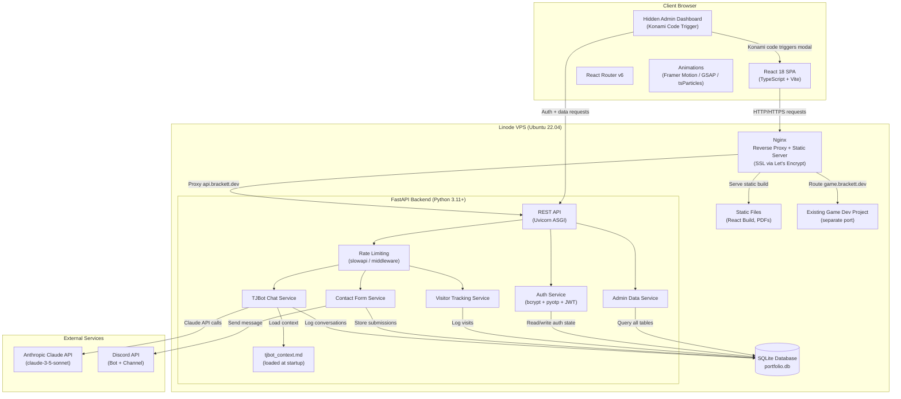

# brackett.dev — Personal Portfolio Website — Architecture

A full-stack personal portfolio website hosted at brackett.dev on a Linode server, designed to showcase TJ Brackett's DevOps engineering, software engineering, full-stack development, and AI integration skills to potential employers. The site features a dark-mode UI with subtle animations, modular project showcase pages, an AI chatbot persona (TJBot) powered by Claude, a Discord-bot-based contact form, a hidden admin dashboard, and comprehensive visitor/conversation logging.

## System Diagram

## React Frontend
**Technology:** React (with React Router for client-side routing), CSS/Tailwind or styled-components, animation library (GSAP, Framer Motion, or tsParticles — to be selected during implementation)

Single-page application built with React that serves as the user-facing portfolio website. Compiled to a static build and served by Nginx. Handles all UI rendering, animations, routing between pages, chatbot UI, contact form UI, and client-side visitor duration tracking beacon.

**Responsibilities:**
- Render all portfolio pages: landing page, individual project pages
- Implement sticky header with navigation, resume, and cover letter buttons
- Render hero banner with animated cycling titles and particle background
- Render revolving skills/tech stack banner
- Render About Me section with photo and bio
- Render work experience timeline
- Render featured projects grid with links to detail pages
- Render modular project detail page template
- Render 'Want to Learn More?' section with TJBot chatbot UI and Discord contact form
- Manage TJBot conversation session state (in-memory, per session)
- Send visit duration beacon to backend on page unload
- Listen for Konami code and trigger hidden admin login modal
- Render admin login modal with password and TOTP fields
- Render admin dashboard (post-authentication) with conversation logs, contact submissions, and visitor logs

**Dependencies:** FastAPI Backend, Nginx

## FastAPI Backend
**Technology:** Python 3.11+, FastAPI, Uvicorn (ASGI server), SQLite (via SQLAlchemy or aiosqlite), pyotp (TOTP), anthropic Python SDK, discord.py or discord-webhook, slowapi or custom rate limiting middleware

Python-based REST API server handling all dynamic functionality: Claude API proxying for TJBot, Discord bot message dispatch for the contact form, SQLite database operations for logging and admin data, admin authentication (password + TOTP), and rate limiting. Runs as a systemd service on the Linode server.

**Responsibilities:**
- Expose REST API endpoints for TJBot chat, contact form, visitor tracking, and admin operations
- Proxy requests to Anthropic Claude API with system prompt and context injection
- Enforce per-IP rate limiting on public endpoints
- Log all TJBot conversations to SQLite
- Log all contact form submissions to SQLite and dispatch to Discord
- Log all visitor page visits and durations to SQLite
- Handle admin authentication: password verification, TOTP verification, account lockout after 5 failed attempts, JWT session issuance
- Serve admin dashboard data (conversations, submissions, visitor logs) to authenticated admin
- Handle admin delete operations on log entries
- Serve resume and cover letter PDF files (or Nginx handles this directly)
- Check Claude API health status for TJBot degradation handling
- Load TJBot context from tjbot_context.md at startup

**Dependencies:** SQLite Database, Anthropic Claude API, Discord API

## Nginx
**Technology:** Nginx, Let's Encrypt (Certbot) for SSL

Reverse proxy and static file server sitting in front of all services on the Linode server. Handles SSL/TLS termination, serves the React static build for brackett.dev, proxies API requests to the FastAPI backend at api.brackett.dev, and routes traffic for the existing game dev project.

**Responsibilities:**
- Serve React static build files for brackett.dev
- Proxy /api/* requests (or all api.brackett.dev requests) to FastAPI backend
- Handle SSL/TLS termination for brackett.dev and api.brackett.dev
- Redirect HTTP to HTTPS
- Route traffic for the existing game dev project (separate server block)
- Serve PDF files for resume and cover letter (or proxy to FastAPI)
- Generate access logs for potential parsing into visitor tracking

**Dependencies:** React Frontend, FastAPI Backend

## SQLite Database
**Technology:** SQLite 3, accessed via SQLAlchemy (sync or async) or aiosqlite from FastAPI

Persistent storage for all application data including TJBot conversation logs, Discord contact form submissions, site visitor logs, and admin authentication state. Stored as a file on the Linode server.

**Responsibilities:**
- Store TJBot conversation sessions and message history
- Store Discord contact form submissions
- Store site visitor logs (IP, page, timestamp, duration)
- Store admin account credentials (hashed password, TOTP secret, lockout state)
- Provide queryable data for admin dashboard

## Anthropic Claude API
**Technology:** Anthropic Claude API (claude-3-5-sonnet or latest recommended model), anthropic Python SDK

External AI service used to power TJBot. The FastAPI backend calls this API with a system prompt containing TJ's context document and the conversation history to generate responses.

**Responsibilities:**
- Generate TJBot responses based on system prompt, context, and conversation history
- Enforce guardrails via system prompt instructions

## Discord Bot
**Technology:** Discord API (via discord-webhook or discord.py), Discord Developer Portal bot registration

A Discord bot created for this project that receives contact form submissions from the FastAPI backend and posts them to a designated channel in TJ's Discord server.

**Responsibilities:**
- Receive formatted contact form submission messages from FastAPI
- Post messages to the designated Discord channel including all form fields and response preferences

**Dependencies:** FastAPI Backend

## Linode Cloud Server
**Technology:** Linode VPS, Linux (Ubuntu or similar), systemd

The hosting environment for the entire stack. Runs Nginx, the FastAPI backend (via systemd/uvicorn), the SQLite database file, and the React static build. Also hosts the existing game dev project.

**Responsibilities:**
- Host all application components
- Maintain SSL certificates via Certbot auto-renewal
- Run Nginx as the primary web server/reverse proxy
- Run FastAPI backend as a systemd service
- Store SQLite database file with appropriate permissions
- Store PDF files for resume and cover letter
- Store tjbot_context.md context file
- Cohost the existing game dev project
