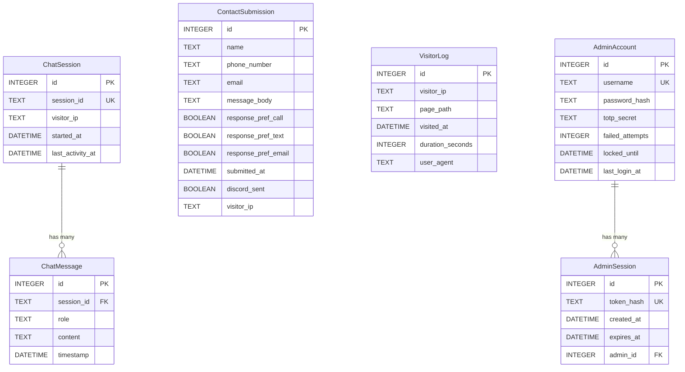

# brackett.dev — Personal Portfolio Website — Data Model

## Entity Relationship Diagram

## ChatSession
Represents a single TJBot conversation session initiated by a site visitor

| Field | Type |
|---|---|
| id | INTEGER PRIMARY KEY AUTOINCREMENT |
| session_id | TEXT UNIQUE NOT NULL — UUID generated client-side or server-side at session start |
| visitor_ip | TEXT NOT NULL — IP address of the visitor |
| started_at | DATETIME NOT NULL — timestamp when session was created |
| last_activity_at | DATETIME NOT NULL — timestamp of last message in session |

**Relationships:** ChatMessage via one-to-many (session_id)

## ChatMessage
Represents a single message turn within a TJBot conversation session

| Field | Type |
|---|---|
| id | INTEGER PRIMARY KEY AUTOINCREMENT |
| session_id | TEXT NOT NULL — foreign key to ChatSession.session_id |
| role | TEXT NOT NULL — 'user' or 'assistant' |
| content | TEXT NOT NULL — message text content |
| timestamp | DATETIME NOT NULL — when the message was sent/received |

**Relationships:** ChatSession via many-to-one (session_id)

## ContactSubmission
Represents a contact form submission sent via the Discord bot

| Field | Type |
|---|---|
| id | INTEGER PRIMARY KEY AUTOINCREMENT |
| name | TEXT NOT NULL — submitter's full name |
| phone_number | TEXT NOT NULL — submitter's phone number |
| email | TEXT NOT NULL — submitter's email address |
| message_body | TEXT NOT NULL — the message content |
| response_pref_call | BOOLEAN NOT NULL DEFAULT FALSE — whether Call was selected |
| response_pref_text | BOOLEAN NOT NULL DEFAULT FALSE — whether Text was selected |
| response_pref_email | BOOLEAN NOT NULL DEFAULT FALSE — whether Email was selected |
| submitted_at | DATETIME NOT NULL — submission timestamp |
| discord_sent | BOOLEAN NOT NULL DEFAULT FALSE — whether Discord dispatch succeeded |
| visitor_ip | TEXT — IP address of submitter |

## VisitorLog
Represents a single page visit by a site visitor across any page of the portfolio

| Field | Type |
|---|---|
| id | INTEGER PRIMARY KEY AUTOINCREMENT |
| visitor_ip | TEXT NOT NULL — IP address of the visitor |
| page_path | TEXT NOT NULL — the URL path visited (e.g., '/', '/projects/indie-game') |
| visited_at | DATETIME NOT NULL — timestamp when the visit started |
| duration_seconds | INTEGER — visit duration in seconds, populated by client beacon on unload (nullable until beacon fires) |
| user_agent | TEXT — browser user agent string |

## AdminAccount
Represents the single admin account for the hidden dashboard. Only one record should exist.

| Field | Type |
|---|---|
| id | INTEGER PRIMARY KEY AUTOINCREMENT |
| username | TEXT UNIQUE NOT NULL — admin username |
| password_hash | TEXT NOT NULL — bcrypt-hashed password |
| totp_secret | TEXT NOT NULL — base32 TOTP secret for 2FA (pyotp compatible) |
| failed_attempts | INTEGER NOT NULL DEFAULT 0 — consecutive failed login attempts |
| locked_until | DATETIME — if set, account is locked until this timestamp |
| last_login_at | DATETIME — timestamp of last successful login |

## AdminSession
Represents an active admin session token (or can be handled via JWT without DB storage — implementation decision)

| Field | Type |
|---|---|
| id | INTEGER PRIMARY KEY AUTOINCREMENT |
| token_hash | TEXT UNIQUE NOT NULL — hashed JWT or session token |
| created_at | DATETIME NOT NULL |
| expires_at | DATETIME NOT NULL — session expiry (e.g., 30 minutes from creation) |
| admin_id | INTEGER NOT NULL — foreign key to AdminAccount.id |

**Relationships:** AdminAccount via many-to-one (admin_id)
