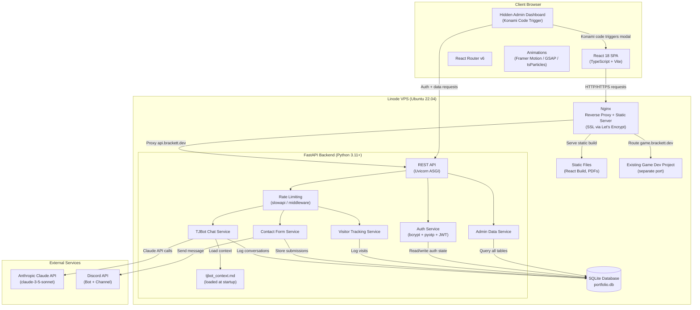
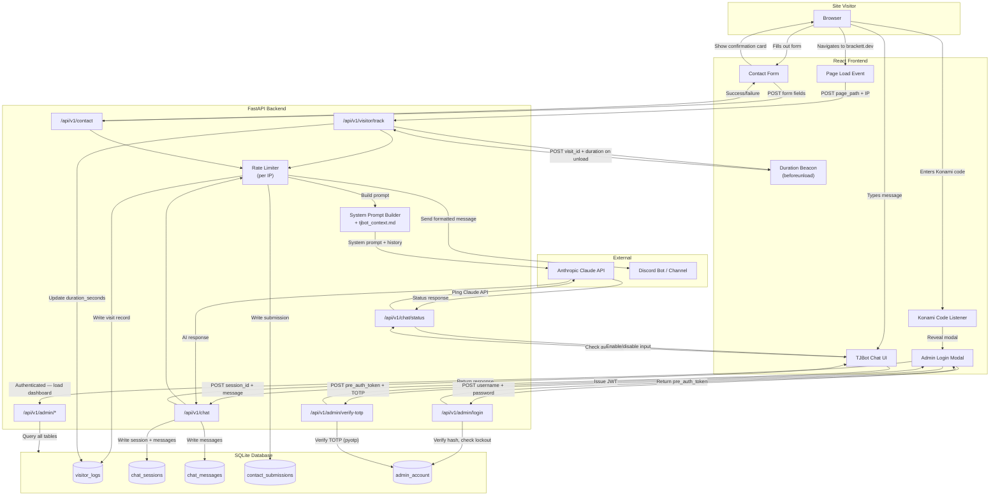
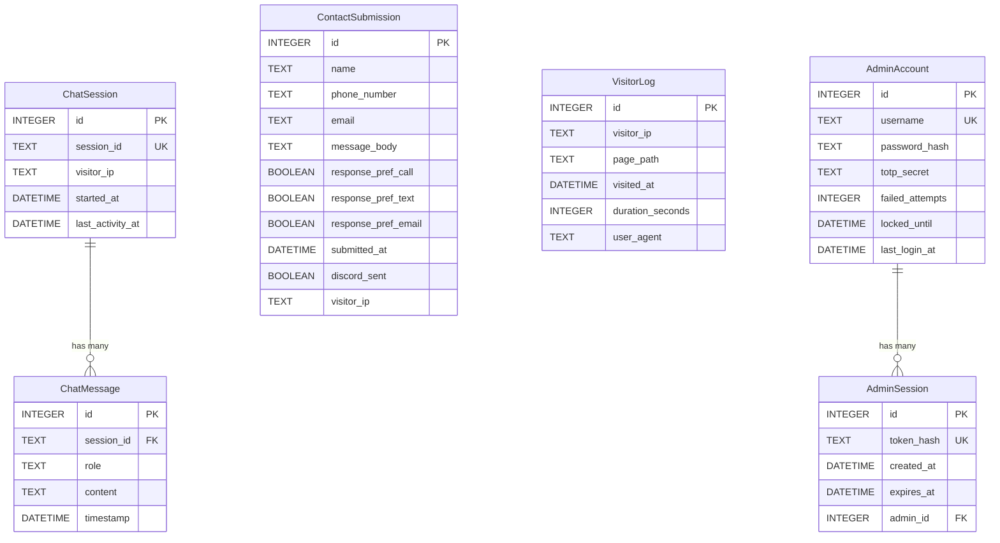

# brackett.dev — Personal Portfolio Website — Diagrams

## Architecture

```mermaid
graph TD
  subgraph Client["Client Browser"]
    React["React 18 SPA\n(TypeScript + Vite)"]
    Router["React Router v6"]
    Animations["Animations\n(Framer Motion / GSAP / tsParticles)"]
    AdminUI["Hidden Admin Dashboard\n(Konami Code Trigger)"]
  end

  subgraph Linode["Linode VPS (Ubuntu 22.04)"]
    Nginx["Nginx\nReverse Proxy + Static Server\n(SSL via Let's Encrypt)"]

    subgraph Backend["FastAPI Backend (Python 3.11+)"]
      API["REST API\n(Uvicorn ASGI)"]
      RateLimit["Rate Limiting\n(slowapi / middleware)"]
      AuthService["Auth Service\n(bcrypt + pyotp + JWT)"]
      ChatService["TJBot Chat Service"]
      ContactService["Contact Form Service"]
      VisitorService["Visitor Tracking Service"]
      AdminService["Admin Data Service"]
      ContextMD["tjbot_context.md\n(loaded at startup)"]
    end

    SQLite[("SQLite Database\nportfolio.db")]
    StaticFiles["Static Files\n(React Build, PDFs)"]
    GameDev["Existing Game Dev Project\n(separate port)"]
  end

  subgraph External["External Services"]
    Claude["Anthropic Claude API\n(claude-3-5-sonnet)"]
    Discord["Discord API\n(Bot + Channel)"]
  end

  React -->|"HTTP/HTTPS requests"| Nginx
  Nginx -->|"Serve static build"| StaticFiles
  Nginx -->|"Proxy api.brackett.dev"| API
  Nginx -->|"Route game.brackett.dev"| GameDev

  API --> RateLimit
  RateLimit --> ChatService
  RateLimit --> ContactService
  RateLimit --> VisitorService
  API --> AuthService
  API --> AdminService

  ChatService -->|"Load context"| ContextMD
  ChatService -->|"Claude API calls"| Claude
  ChatService -->|"Log conversations"| SQLite

  ContactService -->|"Store submissions"| SQLite
  ContactService -->|"Send message"| Discord

  VisitorService -->|"Log visits"| SQLite

  AuthService -->|"Read/write auth state"| SQLite
  AdminService -->|"Query all tables"| SQLite

  AdminUI -->|"Konami code triggers modal"| React
  AdminUI -->|"Auth + data requests"| API
```

## Data Flow

```mermaid
flowchart TD
  subgraph Visitor["Site Visitor"]
    VBrowser["Browser"]
  end

  subgraph FE["React Frontend"]
    PageLoad["Page Load Event"]
    ChatUI["TJBot Chat UI"]
    ContactForm["Contact Form"]
    BeaconJS["Duration Beacon\n(beforeunload)"]  
    KonamiListener["Konami Code Listener"]
    AdminModal["Admin Login Modal"]
  end

  subgraph BE["FastAPI Backend"]
    VisitTrack["/api/v1/visitor/track"]
    ChatEndpoint["/api/v1/chat"]
    ChatStatus["/api/v1/chat/status"]
    ContactEndpoint["/api/v1/contact"]
    AdminLogin["/api/v1/admin/login"]
    AdminTOTP["/api/v1/admin/verify-totp"]
    AdminData["/api/v1/admin/*"]
    RateLimiter["Rate Limiter\n(per IP)"]
    SystemPrompt["System Prompt Builder\n+ tjbot_context.md"]
  end

  subgraph Storage["SQLite Database"]
    VisitorLogs[("visitor_logs")]
    ChatSessions[("chat_sessions")]
    ChatMessages[("chat_messages")]
    ContactSubmissions[("contact_submissions")]
    AdminAccount[("admin_account")]
  end

  subgraph Ext["External"]
    ClaudeAPI["Anthropic Claude API"]
    DiscordAPI["Discord Bot / Channel"]
  end

  VBrowser -->|"Navigates to brackett.dev"| PageLoad
  PageLoad -->|"POST page_path + IP"| VisitTrack
  VisitTrack --> RateLimiter
  RateLimiter -->|"Write visit record"| VisitorLogs
  VisitTrack -->|"Return visit_id"| BeaconJS
  BeaconJS -->|"POST visit_id + duration on unload"| VisitTrack
  VisitTrack -->|"Update duration_seconds"| VisitorLogs

  VBrowser -->|"Types message"| ChatUI
  ChatUI -->|"Check availability"| ChatStatus
  ChatStatus -->|"Ping Claude API"| ClaudeAPI
  ClaudeAPI -->|"Status response"| ChatStatus
  ChatStatus -->|"Enable/disable input"| ChatUI
  ChatUI -->|"POST session_id + message"| ChatEndpoint
  ChatEndpoint --> RateLimiter
  RateLimiter -->|"Build prompt"| SystemPrompt
  SystemPrompt -->|"System prompt + history"| ClaudeAPI
  ClaudeAPI -->|"AI response"| ChatEndpoint
  ChatEndpoint -->|"Write session + messages"| ChatSessions
  ChatEndpoint -->|"Write messages"| ChatMessages
  ChatEndpoint -->|"Return response"| ChatUI

  VBrowser -->|"Fills out form"| ContactForm
  ContactForm -->|"POST form fields"| ContactEndpoint
  ContactEndpoint --> RateLimiter
  RateLimiter -->|"Write submission"| ContactSubmissions
  RateLimiter -->|"Send formatted message"| DiscordAPI
  ContactEndpoint -->|"Success/failure"| ContactForm
  ContactForm -->|"Show confirmation card"| VBrowser

  VBrowser -->|"Enters Konami code"| KonamiListener
  KonamiListener -->|"Reveal modal"| AdminModal
  AdminModal -->|"POST username + password"| AdminLogin
  AdminLogin -->|"Verify hash, check lockout"| AdminAccount
  AdminLogin -->|"Return pre_auth_token"| AdminModal
  AdminModal -->|"POST pre_auth_token + TOTP"| AdminTOTP
  AdminTOTP -->|"Verify TOTP (pyotp)"| AdminAccount
  AdminTOTP -->|"Issue JWT"| AdminModal
  AdminModal -->|"Authenticated — load dashboard"| AdminData
  AdminData -->|"Query all tables"| Storage
```

## Erd

```mermaid
erDiagram
  ChatSession {
    INTEGER id PK
    TEXT session_id UK
    TEXT visitor_ip
    DATETIME started_at
    DATETIME last_activity_at
  }

  ChatMessage {
    INTEGER id PK
    TEXT session_id FK
    TEXT role
    TEXT content
    DATETIME timestamp
  }

  ContactSubmission {
    INTEGER id PK
    TEXT name
    TEXT phone_number
    TEXT email
    TEXT message_body
    BOOLEAN response_pref_call
    BOOLEAN response_pref_text
    BOOLEAN response_pref_email
    DATETIME submitted_at
    BOOLEAN discord_sent
    TEXT visitor_ip
  }

  VisitorLog {
    INTEGER id PK
    TEXT visitor_ip
    TEXT page_path
    DATETIME visited_at
    INTEGER duration_seconds
    TEXT user_agent
  }

  AdminAccount {
    INTEGER id PK
    TEXT username UK
    TEXT password_hash
    TEXT totp_secret
    INTEGER failed_attempts
    DATETIME locked_until
    DATETIME last_login_at
  }

  AdminSession {
    INTEGER id PK
    TEXT token_hash UK
    DATETIME created_at
    DATETIME expires_at
    INTEGER admin_id FK
  }

  ChatSession ||--o{ ChatMessage : "has many"
  AdminAccount ||--o{ AdminSession : "has many"
```
